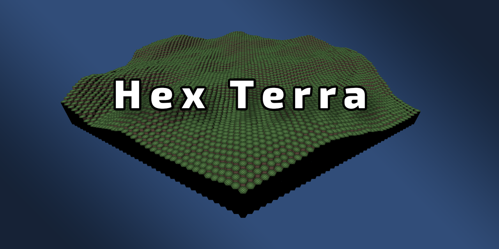

# Hex Map

A Unity project that procedurally generates configurable, height-mapped hex grids: a grid of
hexagonal cells with per-cell elevation, rendered in 3D as tiered terrain with walls between
neighbouring height steps.

One component drives the whole map: choose an outline (hexagon, rectangle, parallelogram), a
size, a seed, and a height source. The default source is a composable noise graph (Perlin,
Simplex, and Worley primitives through fractal, domain-warp, curve, terrace, remap, blur, and
multi-layer blend nodes, saved as reusable presets); image-based and flat sources are
alternatives. Generation is deterministic, and noise can be tuned live in the editor. The core
is a self-contained package (`Packages/com.hexterra.core`, "HexTerra").

Hex coordinates and neighbour maths follow
[Red Blob Games: Hexagonal Grids](https://www.redblobgames.com/grids/hexagons/).

## License

MIT. See [LICENSE](LICENSE).
